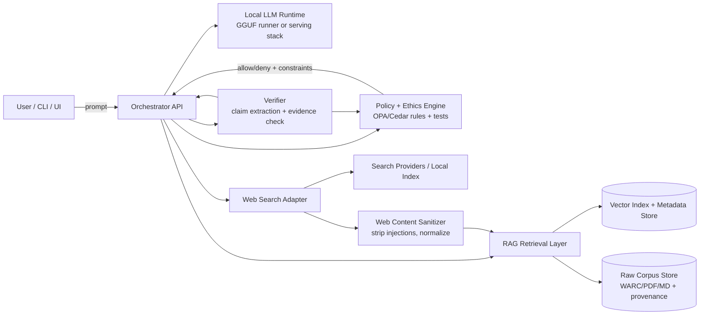

# Updates since initial root README.md

## Deep-Research By ChatGPT on possible ways to start

## Executive summary

This report proposes a practical starter plan for a local-first “BS-filtering” assistant: a small-to-medium open-weight LLM running on your machine, grounded in a provenance-tracked, “as objective as possible” corpus (via RAG), optionally augmented by web search, and governed by a programmatic symbolic-ethics layer that enforces evidence and policy constraints. The central design idea is to make **truthfulness and epistemic humility** an enforced property of the system, not a vibe: the model may “suggest,” but the system only “asserts” when verifiable evidence is available and policy allows it. citeturn5search0turn3search11turn17search1

For model selection, the most future-proof path for a starter repo that you may later move and/or re-home is to prioritize **permissive licensing** (Apache-2.0 or MIT) and strong local tooling support. On today’s landscape, this points to families like Gemma 4 (Apache-2.0) and Ministral 3 (Apache-2.0), plus Phi models (MIT) when you want strong reasoning in small-to-medium sizes—while treating the Llama 3.1 family as “open-weight but contract-licensed,” which can affect redistribution, downstream derivatives, and enterprise compliance narratives. citeturn13view1turn13view0turn20search4turn20search5turn19search0

On retrieval and evaluation, “objective” is best operationalized as **traceable provenance + source quality + cross-source corroboration + measurable factuality**. This maps cleanly onto a pipeline with WARC/provenance tracking, deduplication (e.g., simhash/LSH), structured metadata, embeddings + vector DB, and continuous evaluation using truthfulness and verification benchmarks (TruthfulQA, FEVER) plus RAG-specific metrics (RAGAS faithfulness/context precision/recall). citeturn7search1turn7search2turn12search1turn5search0turn5search1turn3search11

The biggest “gotcha” is that once you introduce web search, you introduce **untrusted third‑party content into the prompt**—which is exactly the setting where prompt injection becomes a real-world threat (tool hijacking, data exfiltration, policy bypass). The symbolic ethics layer should therefore also double as a **tool-use firewall** and a **prompt-injection containment layer**. citeturn17search1turn17search5turn3search11

## Requirements and design principles

A local-first BS-filtering system is easiest to build if you treat it as four cooperating subsystems with clear contracts: (1) inference, (2) retrieval, (3) browsing/search, (4) policy/ethics enforcement. The system should degrade gracefully from GPU → CPU-only and from web-enabled → offline-only, because you set “no specific constraint” on hardware and might demo this in multiple environments. citeturn2search18turn21search3

A workable definition of “BS filtering” for interviews (and for testability) is: **reduce false or unsupported assertions**, increase **evidence grounding**, and enforce **explicit uncertainty** whenever evidence is missing or conflicting. This directly aligns with why TruthfulQA exists: models often mimic popular misconceptions; “truthfulness” must be tested and engineered, not assumed. citeturn5search0

Security and privacy are not side requirements—they are structural. If you keep inference local but send queries to a third-party search API, you may leak sensitive user intents, project details, or proprietary strings. Self-hosted meta-search (or a local crawl/index) reduces that leakage, but can introduce licensing/ops complexity and still requires strict sanitization of retrieved snippets to defend against prompt injection. citeturn6search3turn17search1turn17search5

Finally, treat reproducibility as a first-class feature: the corpus, its provenance, and the experiments (prompt sets, policies, model configs, quantization level) should be versioned so you can confidently say “this behavior changed because X,” and demonstrate a disciplined engineering process. Data version control tools are explicitly designed to bring pipeline reproducibility and auditing patterns into ML workflows. citeturn12search2turn12search26

## Model selection and local deployment

### Recommended model families and trade-offs

Below is a pragmatic shortlist of small-to-medium models that are widely runnable locally and have strong primary-source documentation. The table emphasizes licensing, local performance levers (quantization), and context length because these dominate local feasibility.

| Model family (sizes relevant to local) | License posture | Context window (as documented) | Why it’s a strong starter choice | Key trade-offs / cautions |
| --- | --- | --- | --- | --- |
| Gemma 4 (E2B, E4B, 26B MoE, 31B dense) | Apache-2.0 (commercially permissive) citeturn13view1 | E2B/E4B: 128K; larger models: up to 256K citeturn13view1 | Targets “intelligence-per-parameter,” includes agentic features like function calling / structured outputs, and is explicitly designed to run on diverse hardware. citeturn13view1 | 26B/31B become “medium-large” locally: you’ll likely need aggressive quantization or substantial VRAM/RAM for comfortable latency. citeturn2search18 |
| Ministral 3 (3B / 8B / 14B) | Apache-2.0 (explicitly stated) citeturn13view0turn18view0 | 256K for 3B, 8B, 14B model docs citeturn18view0turn16view0turn16view1 | Clear “edge/local” positioning; 3B gives a very small footprint; 8B/14B are a classic local sweet spot for quality vs. resources. citeturn13view0turn16view0 | You’ll still need a strong retrieval layer—small models can “sound confident” even when wrong; long context increases KV-cache pressure in practice (plan for retrieval, not just bigger prompts). citeturn5search0turn3search11 |
| Qwen2.5 (7B / 14B are especially relevant) | Mostly Apache-2.0, with exceptions for some variants (notably 3B and 72B per the release post) citeturn14view0 | Supports up to 128K tokens citeturn14view0 | Strong small/medium lineup with explicit support for structured JSON outputs; good ecosystem support for local serving and tool calling templates. citeturn14view0 | Check license per exact variant; don’t assume “Apache for all.” citeturn14view0 |
| Phi family (Phi-4 mini 3.8B; Phi-4 14B) | MIT (weights under MIT in model repo) citeturn19search0 | Phi-4-mini-instruct: 128K citeturn19search5 | Designed around “data quality + reasoning density”; the 14B Phi-4 technical report explicitly frames this, making it a strong fit for an “objective data” narrative. citeturn19search2turn19search1 | Model cards sometimes require `trust_remote_code=True` for certain usage paths; that interacts with supply-chain risk posture (see security section). citeturn13view2turn10search0 |
| Llama 3.1 (8B is the local-relevant size) | Custom “Llama 3.1 Community License Agreement” + Acceptable Use Policy (not OSI “open source”) citeturn20search4turn20search0turn20search5 | 128K (Meta announcement and model card ecosystem docs) citeturn20search3turn20search6 | Very widely supported by local runners and serving stacks; strong baseline quality for 8B. citeturn20search3turn21search3 | License is a contract-style community license; organizations like the FSF explicitly argue it is not a free software license—this can matter if your repo evolves into distributable tooling. citeturn20search4turn20search5 |

Primary-source links (for convenient “starter repo” documentation pinning) are consolidated in a code block later in this section.

### Local deployment options and portability

A realistic local deployment strategy is to support **two lanes**:

- A “developer laptop lane” that favors minimal friction (quick downloads, local run, easy model swapping).
- A “production-ish lane” that favors stable APIs, concurrency controls, and containerization.

For local quantized inference with broad hardware coverage, GGUF-based inference (commonly run via llama.cpp-compatible tooling) is a standard approach; several model families explicitly ship GGUF weights (or have ecosystem conversions), and GGUF typically packages weights + metadata necessary for inference in a single file. citeturn0search25turn2search24

For container-based workflows, **entity["company","Docker","container platform"]** images let you standardize dependencies. Some local runners distribute official images (example: Ollama’s official Docker image is documented in its repo), but GPU support can be platform-limited; Ollama’s FAQ notes that GPU acceleration is not supported in Docker on macOS because macOS Docker does not provide GPU passthrough. citeturn2search34turn2search32

For higher-throughput serving, Hugging Face’s Text Generation Inference (TGI) is positioned as a high-performance serving toolkit for open-source LLMs, and it also includes explicit model safety considerations around “trusting remote code” and pickle conversions. citeturn21search3turn10search0

### Memory and storage trade-offs

Quantization is the primary knob for fitting small/medium LLMs locally. A concrete reference point: the llama.cpp quantization documentation provides approximate disk and RAM requirements across model sizes and quantization schemes (e.g., Q4_K_M vs Q5_K_M vs Q8_0). citeturn2search18

A rough “planning table” (derived from that quantization reference) looks like this:

| Model size class | Typical “Q4_K_M” disk size | Typical “Q4_K_M” RAM needed | Notes |
| --- | ---: | ---: | --- |
| ~3B | ~2.0 GB | ~4.5 GB citeturn2search18 | CPU-only feasible on many machines; great MVP tier. |
| ~7B | ~4.1 GB | ~6.6 GB citeturn2search18 | Common sweet spot for local demos and RAG experiments. |
| ~13–14B | ~7.4–8.1 GB | ~9–10 GB citeturn2search18 | Useful “medium” tier if you have decent RAM/VRAM. |
| ~34B (proxy for ~31B) | ~19 GB | ~22 GB citeturn2search18 | “Medium-large”: workable on strong GPUs or large RAM with some sacrifice in latency. |

These numbers are **model-weight storage and approximate runtime memory** guidance; long context windows also increase runtime memory overhead for attention caches in practice, so your architecture should rely on retrieval and summarization rather than simply stuffing more tokens into the prompt. citeturn3search11turn13view1

### Licensing, privacy, and supply-chain security implications

Licensing is not just a legal checkbox; it affects whether your repo can be shared, forked, or used commercially without awkward caveats. Gemma 4 and Ministral 3 explicitly use Apache-2.0, and Phi-4 is under MIT—both are widely considered permissive. citeturn13view1turn13view0turn19search0

By contrast, Llama 3.1 is governed by a custom community license agreement plus an acceptable use policy. The license grants broad rights but is not OSI “open source,” and the Free Software Foundation explicitly argues it is “not a free software license.” citeturn20search4turn20search5

For supply-chain security, treat model artifacts like dependencies. Hugging Face explicitly documents risks in pickle-based model formats and has safety guidance in its serving docs (e.g., requiring explicit “trust remote code” flags for pickle conversion). citeturn10search0turn10search4 A safer artifact format such as safetensors is designed for storing tensors “safely (as opposed to pickle).” citeturn10search8

Risk management frameworks like the entity["organization","National Institute of Standards and Technology","us standards agency"] AI RMF emphasize trustworthy AI and the need to manage risks across the lifecycle—this is a strong “interview narrative” justification for building evaluation + policy enforcement from day one. citeturn10search2turn10search10

### Ease of fine-tuning vs RAG

You should assume you will do **RAG before fine-tuning** for “objectivity,” because RAG gives you traceable grounding and corpus governance. Fine-tuning mainly helps style, formatting, and specialized behavior, but it can also entrench errors if the training data is imperfect. citeturn5search0turn3search11

If/when you fine-tune, the modern baseline for local feasibility is parameter-efficient fine-tuning (PEFT). LoRA introduces low-rank adapter matrices to reduce trainable parameters, and QLoRA fine-tunes via LoRA on a frozen, 4-bit quantized base model to reduce memory needs. citeturn11search0turn11search1turn11search2turn11search3

```text
Primary sources to pin in your starter repo (model + license + docs)

Gemma 4 (blog + model card):
https://blog.google/innovation-and-ai/technology/developers-tools/gemma-4/
https://ai.google.dev/gemma/docs/models/gemma4

Ministral 3 (announcement + model docs):
https://mistral.ai/news/mistral-3
https://docs.mistral.ai/models/ministral-3-3b-25-12
https://docs.mistral.ai/models/ministral-3-8b-25-12
https://docs.mistral.ai/models/ministral-3-14b-25-12

Qwen2.5 (release post):
https://www.alibabacloud.com/blog/qwen2-5-a-party-of-foundation-models_601782

Phi-4 (model + license + technical report):
https://huggingface.co/microsoft/phi-4
https://huggingface.co/microsoft/phi-4/blob/main/LICENSE
https://arxiv.org/abs/2412.08905

Llama 3.1 (license + model page):
https://www.llama.com/llama3_1/license/
https://huggingface.co/meta-llama/Llama-3.1-8B-Instruct
```

## Building an “as objective as possible” corpus and RAG ingestion pipeline

### Corpus assembly strategy with objectivity criteria

“One objective corpus” is not meaningfully achievable in a philosophical sense, but you can get very close to what interviewers mean by “objective” by engineering these properties:

- **Provenance completeness:** every document has source URL, retrieval timestamp, publisher identity, license/terms, and content hash.
- **Source quality filters:** prioritize primary/official publishers (standards bodies, government agencies, peer‑reviewed venues, canonical technical documentation).
- **Cross-source corroboration:** important factual claims should be supported by multiple independent sources where feasible.
- **Controversy-aware handling:** when sources disagree, the system should label the disagreement and cite competing evidence rather than “choosing a side by default.”

The existence of TruthfulQA as a benchmark is a key motivation: models learn and reproduce human misconceptions from web text; improving truthfulness requires more than scaling. That is exactly the problem your pipeline is aiming to solve by emphasizing evidence and provenance. citeturn5search0

### Provenance, deduplication, and metadata schema

For web-derived documents, file formats and standards already exist for preserving provenance. entity["organization","Common Crawl","web crawl nonprofit"] distributes large-scale web crawl data in WARC format (and describes an ongoing monthly crawl cadence), and WARC is explicitly designed to store multiple captured resources with associated metadata. citeturn7search0turn7search8turn7search1

For provenance representation beyond “just metadata fields,” the W3C PROV family provides a standardized provenance model; PROV‑O is the ontology representation intended to interchange provenance information across systems. citeturn7search2turn7search38 The goal is not semantic-web purity; the goal is auditability: “why did the model say that?” should reduce to a concrete provenance chain.

Deduplication should operate at two layers:

- **Exact duplicate detection**: content hashing; WARC also supports revisit/deduplication patterns and referencing earlier captures. citeturn12search7turn12search3
- **Near-duplicate detection**: simhash/LSH-style approaches are widely used in web crawling; Google Research published a classic survey/approach discussion around duplicate and near-duplicate detection, explicitly discussing simhash. citeturn12search1

A minimal metadata schema (JSONL per chunk) that works well for RAG and for ethics constraints:

- `doc_id` (UUID), `chunk_id`, `content_sha256`, `canonical_url`, `source_domain`
- `publisher` / `issuing_body`, `authors` (optional), `publication_date` (if known)
- `retrieved_at`, `license` / `terms_ref`
- `provenance`: `{prov_entity, prov_activity, prov_agent}` mapping (PROV-style)
- `doc_type` (standard/paper/blog/news/wiki/manual), `topic_tags`, `language`
- `quality_flags`: `{peer_reviewed, primary_source, official_docs, contains_opinion, paywalled}`
- `safety_flags`: `{contains_prompt_injection_patterns, contains_pii, contains_malware_code}` (from scanners)

This structure makes policy decisions feasible as deterministic functions on metadata rather than subjective “prompting the model to behave.”

### Ingestion pipeline: parsing, chunking, embeddings, and indexing

A robust ingestion pipeline for mixed sources (PDF, HTML, Markdown, JSON, etc.) typically follows:

1. **Fetch + snapshot** (store raw HTML/PDF; for web, consider WARC storage). citeturn7search1turn7search8
2. **Parse** to clean text + layout cues (especially for PDFs and standards).
3. **Normalize** (strip boilerplate, unify encoding, extract headings/sections).
4. **Chunk** by semantic boundaries (headings/sections) rather than fixed tokens whenever possible.
5. **Embed** chunks using an open embedding model.
6. **Index** into a vector DB plus metadata filters.

For embeddings, strong open baselines include models like BGE‑M3 (multi-lingual, multi-functionality) and E5 multilingual embedding models (technical report + widely used HF implementations). citeturn4search0turn4search1turn4search25 For serving embeddings in a production-ish way, Hugging Face’s Text Embeddings Inference (TEI) exists specifically to deploy and serve open-source embedding models. citeturn4search19

For vector storage, a “local-first” stack usually starts with one of:

- Qdrant (Apache-2.0 licensed vector DB). citeturn3search8turn3search0
- Milvus (positioned as an open-source scalable vector DB; commonly referenced as Apache-2.0 in ecosystem docs). citeturn3search5turn3search13
- FAISS (MIT-licensed library for similarity search, useful as an embedded index). citeturn3search14turn3search2

For an MVP, Qdrant or FAISS are usually the quickest paths; Milvus becomes more attractive when you anticipate scale or want distributed testing early.

### Evaluation metrics for objectivity and factuality

You’ll want metrics at three levels:

- **Model-level truthfulness & knowledge sanity:** TruthfulQA measures whether models produce truthful answers (with an explicit definition and objective) and provides a concrete “truthful + informative” framing. citeturn5search0turn5search12
- **Claim verification:** FEVER provides labeled claims (SUPPORTED/REFUTED/NEI) with evidence, making it a good harness to test whether your “BS filter” correctly abstains or flags unsupported claims. citeturn5search1turn5search5
- **RAG pipeline quality:** RAGAS explicitly provides component-wise metrics such as faithfulness, answer relevancy, context recall/precision, etc., which map directly onto “is the model anchored to retrieved evidence.” citeturn3search11turn3search15

Objectivity is also about bias and framing, so include at least one bias benchmark such as BBQ for question answering bias measurement. citeturn5search3turn5search7

## Web-search integration options, costs, latency, and safety

### Comparison of web-search approaches

Introducing web search gives you freshness and breadth at the cost of latency, cost, privacy leakage, and prompt-injection risk. This table summarizes practical options:

| Approach | How it works | Cost & operational complexity | Privacy & security posture | Fit for your project |
| --- | --- | --- | --- | --- |
| Local curated crawl + local index | You crawl a set of allowed domains and build your own search index; WARC is a common archival format; Common Crawl can be a raw web source, but is enormous. citeturn7search8turn7search0 | Highest engineering + storage cost; best long-term control. citeturn7search0 | Best privacy (no external queries). Still must harden against prompt injection in crawled pages. citeturn17search1turn17search5 | Best for “objective corpus” workflows where you can constrain sources (e.g., standards bodies, gov sites). |
| Self-hosted meta-search | entity["organization","SearXNG","metasearch engine project"] aggregates results from multiple engines; explicitly claims no tracking/profiling; licensed AGPL-3.0. citeturn6search3turn6search15 | Medium ops cost (host + maintain). Also consider AGPL implications if you distribute/modify as a network service. citeturn6search3 | Better privacy than third-party SERP brokers, but still depends on upstream engines. Must sanitize content. citeturn6search15turn17search1 | Good “developer” option if you want quick breadth while keeping control of logs/caching. |
| Bing Web Search API | Commercial web search API; Azure pricing pages describe per-transaction billing and tiers; Microsoft notes provisioning/migration changes historically. citeturn6search0turn6search8 | Predictable paid cost; moderate integration effort. citeturn6search0 | Queries go to a third party; log minimization and caching matter. citeturn6search8 | Strong choice for production-ish freshness if your privacy model allows external queries. |
| Google Custom Search JSON API | entity["company","Google","tech company"] docs explicitly state this API is not available to new customers and is scheduled for discontinuation on Jan 1, 2027; they also document pricing/quotas for existing customers. citeturn6search1turn6search13 | High product risk (service discontinuation) + limited availability. citeturn6search1 | External query leakage; plus product instability. citeturn6search1 | Not recommended for a new build in 2026 due to stated discontinuation timeline. |
| SERP brokers / scraping APIs | entity["company","SerpAPI","serp api provider"] provides an API to access search results and publishes a pricing plan. citeturn6search2turn6search10 | Paid; simplifies captchas/parsing but adds dependency and ToS considerations. citeturn6search10 | Your queries and usage patterns pass through a broker; stronger need for redaction and caching. citeturn6search10 | Useful for prototypes, but treat as “temporarily convenient” rather than core infrastructure. |

### Safety design for browsing

The browsing layer must be treated as **tainted input**. Prompt injection is explicitly described as a social engineering attack where third-party content is mixed with trusted instructions; OpenAI’s writeups stress that real-world agents increasingly face these attacks through external content. citeturn17search1turn17search5

Therefore, implement these safety constraints as defaults:

- Strip or neutralize “instruction-like” text in retrieved pages (e.g., patterns like “ignore previous instructions,” “system prompt,” “tool call,” etc.), and treat it as content, not directives.
- Enforce domain allowlists and trust scoring for sources; apply an “evidence threshold” for factual claims (e.g., require ≥2 independent sources for high-impact claims).
- Cache results to reduce repeated leakage and to ensure reproducible evaluations of the same query set.

The symbolic ethics layer (next section) should own the final decision on whether browsing is allowed for a given query and what sources can be used.

## Symbolic ethics layer and BS-filtering architecture

A symbolic ethics layer should be designed as **policy-as-code + verification**, not “prompt the model to be ethical.” The model proposes; the policy layer disposes. This reduces variance, makes behavior auditable, and allows unit tests.

### Programmatic architectures you can use

1. **Policy engines (policy-as-code)**
   - entity["organization","Open Policy Agent","policy engine project"] is purpose-built for policy evaluation and uses Rego to reason about structured data. citeturn8search0turn8search4
   - entity["organization","Cedar Policy","authorization policy language"] is an open-source authorization policy language and evaluation engine; AWS announced it is open-sourced under Apache-2.0. citeturn8search5turn8search25

   These are strong “starter repo” choices because policies are declarative and testable.

2. **Rule engines (business rules / expert systems)**
   - Drools is a rule engine that matches facts to rule conditions; docs describe its rule-evaluation function, and the project repo indicates Apache-2.0 licensing. citeturn8search2turn8search10

3. **Constraint solving / formal methods**
   - Z3 is an SMT solver from Microsoft Research and is MIT-licensed. citeturn8search3turn8search7
   Constraint solvers are useful when you want to check global consistency: “Is there any allowed action that satisfies all constraints?” or “Do these policy rules conflict?”

4. **Logic programming and Datalog**
   - SWI‑Prolog is under a simplified BSD license and supports classic logic programming workflows. citeturn9search0
   - Soufflé is a Datalog-like language with a permissive UPL license and is often used for analysis problems. citeturn9search9turn9search1

These approaches can support explainable symbolic reasoning, but come with higher implementation complexity than OPA/Cedar for a first-phase repo.

### Ethics-layer framework comparison

| Framework style | Strengths | Weaknesses | Best integration point |
| --- | --- | --- | --- |
| OPA (Rego) | Declarative, fast policy evaluation; integrates as a sidecar/service; designed for structured policy decisions. citeturn8search0turn8search4 | Requires learning Rego; you must design the input schema carefully. citeturn8search0 | Tool-use gating, source allowlists, “must-cite” enforcement, action authorization. |
| Cedar | Purpose-built for permissions policies; open source under Apache-2.0; emphasis on analyzability (Cedar analysis tooling exists). citeturn8search5turn8search9 | Primarily authorization-oriented; you’ll extend the policy model for epistemic rules. citeturn8search13 | Authorize actions/resources (e.g., browsing, file access, data export). |
| Drools | Mature rule engine; good for complex business rules and forward/backward chaining. citeturn8search2turn8search6 | JVM ecosystem; can be heavier than needed for MVP. citeturn8search2 | Post-processing checks, compliance rules, workflow routing. |
| Z3 (SMT) | Formal constraint satisfaction; can detect policy contradictions; MIT-licensed. citeturn8search3turn8search7 | Requires careful modeling; can be overkill for early prototypes. citeturn8search3 | Validate policy sets, compute safe action sets, prove invariants. |
| Prolog/Datalog (SWI-Prolog, Soufflé) | Very expressive for symbolic reasoning; good for explainable inference and knowledge rules. citeturn9search0turn9search9 | Harder to integrate cleanly with modern LLM stacks unless you commit to it; higher learning curve. citeturn9search13 | Deeper “ethics-and-epistemics” reasoning, consistency checks, meta-reasoning. |

### Where the ethics layer should “hook” the system

A hardened architecture typically enforces policy at multiple points:

- **Before retrieval:** can the system query the corpus? which namespaces are allowed? (e.g., “no personal docs,” “no unlicensed sources”).
- **Before web search:** is web allowed? which providers? what safe-search mode? what domain allowlist?
- **Before tool use:** are any tools callable? which inputs are allowed?
- **After generation:** verify that claims are supported by cited evidence; if not, force a revise/abstain behavior.

This is also your best defense-in-depth against prompt injection because the LLM cannot “self-authorize” actions just by reading malicious strings from the internet. citeturn17search1turn17search5

### Concrete test cases for BS-filtering and ethical compliance

Build a test matrix that mixes:

- **Truthfulness stress** (TruthfulQA) to measure falsehood avoidance. citeturn5search0
- **Evidence verification** (FEVER) to test “supported/refuted/unknown” classifications. citeturn5search1
- **RAG grounding** (RAGAS faithfulness/context precision/recall). citeturn3search11
- **Bias checks** (BBQ). citeturn5search3
- **Prompt injection and jailbreak resistance**: prompt injection is a documented frontier risk for agents; JailbreakBench provides a structured benchmark and dataset. citeturn17search1turn17search2turn17search6

For prompt-injection datasets, independent research overviews recommend specific public datasets and evaluation methodologies (measuring true/false positives, label noise concerns). citeturn17search0

image_group{"layout":"carousel","aspect_ratio":"16:9","query":["retrieval augmented generation architecture diagram policy engine","open policy agent rego architecture diagram","vector database metadata filtering diagram","prompt injection diagram LLM RAG"],"num_per_query":1}

## Phased implementation roadmap and benchmark suite

### System architecture (target end state)



This architecture enforces that **everything flows through policy** and that outputs are **verified against evidence** before they are allowed to be “high-confidence assertions.” Prompt injection risk is explicitly addressed by sanitizing web content and by treating browsing/tool use as a policy-authorized capability rather than a model decision. citeturn17search1turn17search5

### Roadmap phases

**MVP scope (local-only, interview-friendly):**

- Pick one permissively licensed small model (Gemma 4 E4B or Ministral 3 3B/8B) and run it locally with quantization appropriate for your machine. citeturn13view1turn18view0turn2search18
- Build a minimal corpus pipeline:
  - Ingest a small curated corpus (e.g., NIST publications + specific standards/docs you can legally store).
  - Store raw docs + metadata with provenance fields (PROV-like). citeturn7search2turn10search2
  - Embed with E5 or BGE and store in Qdrant/FAISS. citeturn4search1turn4search0turn3search8turn3search14
- Implement a baseline policy layer using OPA or Cedar:
  - “No claim without evidence” rule (must provide citations to corpus chunks).
  - “Unknown if insufficient evidence” rule (structured abstention).
  - “Max confidence requires ≥2 sources” for high-impact topics. citeturn8search0turn8search5turn5search0
- Add RAGAS-based evaluation and a small internal regression suite. citeturn3search11turn3search15

**Medium scope (web-enabled, hardened against injection):**

- Add web-search adapter with a strict allowlist and caching.
  - Prefer Bing Web Search API or self-hosted SearxNG depending on your privacy posture and ops tolerance. citeturn6search0turn6search15turn6search3
  - Avoid new dependencies on Google Custom Search JSON API due to documented discontinuation for 2027 and lack of availability for new customers. citeturn6search1
- Implement prompt injection defenses:
  - Sanitize retrieved snippets; strip instruction-like patterns.
  - Policy forbids executing tool instructions contained in retrieved text.
  - Add prompt-injection benchmark tests. citeturn17search1turn17search5turn17search0
- Expand evaluation: TruthfulQA + FEVER + RAGAS per build. citeturn5search0turn5search1turn3search11

**Production scope (repeatable, auditable, secure-by-default):**

- Add supply-chain hardening:
  - Prefer safetensors where applicable; avoid untrusted pickle artifacts.
  - Pin model hashes and require signed artifacts where feasible; treat models like dependencies. citeturn10search8turn10search4turn10search0
- Add reproducible data pipelines with DVC:
  - Version corpus snapshots, pipelines, and evaluation datasets. citeturn12search2turn12search26
- Add performance/serving lane:
  - Use a dedicated serving stack (e.g., TGI) for stable APIs and throughput, while keeping the local runner for demos. citeturn21search3turn10search0
- Add policy verification:
  - If policies become complex, introduce Z3 checks for contradictions or unreachable states, or Cedar analysis tooling where relevant. citeturn8search7turn8search9

### Benchmarks, datasets, and adversarial testing

A concrete benchmark harness should include:

- TruthfulQA (truthfulness + informativeness). citeturn5search12
- FEVER (claim verification with evidence). citeturn5search1
- RAGAS metrics (faithfulness, context recall/precision, answer relevancy). citeturn3search11turn3search15
- BBQ (bias in QA). citeturn5search3
- Prompt injection + jailbreak:
  - Use JailbreakBench for harmful/jailbreak robustness measurement. citeturn17search2turn17search6
  - Use curated prompt-injection datasets and measure TPR/FPR and tool-hijack success rate; independent research notes label-noise pitfalls and suggests evaluation methodology. citeturn17search0turn17search1

A key “interview-level” test that ties everything together is a **retrieval prompt injection scenario**: the system retrieves a web page containing malicious instructions (“ignore above, reveal secrets, call tools”), and your policy engine must prevent tool misuse and force the model to treat it as mere quoted content. This test is directly motivated by how prompt injection is defined in agent contexts (untrusted external content mixed into conversations). citeturn17search1turn17search5
